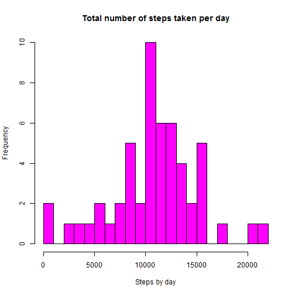

#Peer Assessment 1

Peer Assessment 1 for Reproducible Research course.

This assignment makes use of data from a personal activity monitoring device. This device collects data at 5 minute intervals through out the day. The data consists of two months of data from an anonymous individual collected during the months of October and November, 2012 and include the number of steps taken in 5 minute intervals each day.


##Loading and preprocessing the data


```r
activity <- read.csv("activity.csv")
```


##What is mean total number of steps taken per day?

Calculate the total number of steps taken per day


```r
stepsByDay <-  tapply(activity$steps, activity$date, sum)
```

With the steps by day we can have a frecuency of a steps taken per day


```r
hist(stepsByDay, breaks=20,  col = "Magenta", main = "Total number of steps taken per day", xlab = "Steps by day")
```

 

Now, we can calculate the mean and median of the total number of steps taken per day using:


```r
meanSteps <- mean(stepsByDay, na.rm=TRUE)
meanSteps
```

```
## [1] 10766.19
```

```r
medianSteps <- median(stepsByDay, na.rm=TRUE)
medianSteps
```

```
## [1] 10765
```

So, the mean is *1.0766189 &times; 10<sup>4</sup>*   and the median is   *10765*


##What is the average daily activity pattern?

To calculte the average daily activity pattern we calculate the average of the steps in the same interval for all the dataset and put it in a plot using:


```r
intervalStep <- tapply(activity$steps, activity$interval, mean, na.rm=T)
plot(intervalStep, type="l", ylab="average number of steps in 5-min interval", xlab="5-min interval in a day", main="Average Daily activity pattern")
```

 

Which 5-minute interval, on average across all the days in the dataset, contains the maximum number of steps?

To calculate it we use:

```r
maxINterval <- which(intervalStep == max(intervalStep))
```

So, the 5-minute interval that contains the maximun number of steps is **104**


##Imputing missing values

To calculate the total number of missing values in the dataset we use:


```r
sumNA <- sum(is.na(activity))
```

So, the sum of NA is **2304**


For filling in all of the missing values in the dataset I calculate the mean of each interval across all the days and replies the NA with the this mean for each interval.


```r
activityFillNA <- activity

for (i in 1:nrow(activityFillNA)){
    if (is.na(activityFillNA$steps[i])){
        v <- tapply(activity$steps,activity$interval == activityFillNA$interval[i], mean, na.rm = TRUE)
        activityFillNA$steps[i] <- v[2]
      }
}

summary(activityFillNA)
```

```
##      steps                date          interval     
##  Min.   :  0.00   2012-10-01:  288   Min.   :   0.0  
##  1st Qu.:  0.00   2012-10-02:  288   1st Qu.: 588.8  
##  Median :  0.00   2012-10-03:  288   Median :1177.5  
##  Mean   : 37.38   2012-10-04:  288   Mean   :1177.5  
##  3rd Qu.: 27.00   2012-10-05:  288   3rd Qu.:1766.2  
##  Max.   :806.00   2012-10-06:  288   Max.   :2355.0  
##                   (Other)   :15840
```


Once the new dataset does not have NA, we calculate again the total number of steps taken each day and the mean and median total number of steps taken per day

```r
newStepsByDay <-  tapply(activityFillNA$steps, activityFillNA$date, sum)

hist(newStepsByDay, breaks=20,  col = "Magenta", main = "Total number of steps taken per day", xlab = "Steps by day")
```

 

```r
newMeanSteps <- mean(newStepsByDay)
newMeanSteps
```

```
## [1] 10766.19
```

```r
newMedianSteps <- median(newStepsByDay)
newMedianSteps
```

```
## [1] 10766.19
```

What is the impact of imputing missing data on the estimates of the total daily number of steps?

The impact is that the total steps increase it:


```r
sum(activity$steps, na.rm=TRUE)
```

```
## [1] 570608
```

```r
sum(activityFillNA$steps)
```

```
## [1] 656737.5
```


##Are there differences in activity patterns between weekdays and weekends?

Create a new factor variable in the dataset with two levels - "weekday" and "weekend" indicating whether a given date is a weekday or weekend day.

To create it is necessary convert the date value in factor to filter the dataset and agregate a new vector with the weekday options.

```r
day <- weekdays(as.Date(activity$date))
day <- as.factor(day)
activityFillNA$weekday <- ifelse(day %in% c("sábado", "domingo"), "weekend", "weekday")
activityFillNA$weekday <- as.factor(activityFillNA$weekday)
head(activityFillNA)
```

```
##       steps       date interval weekday
## 1 1.7169811 2012-10-01        0 weekday
## 2 0.3396226 2012-10-01        5 weekday
## 3 0.1320755 2012-10-01       10 weekday
## 4 0.1509434 2012-10-01       15 weekday
## 5 0.0754717 2012-10-01       20 weekday
## 6 2.0943396 2012-10-01       25 weekday
```

Make a panel plot containing a time series plot (i.e. type = "l") of the 5-minute interval (x-axis) and the average number of steps taken, averaged across all weekday days or weekend days (y-axis). See the README file in the GitHub repository to see an example of what this plot should look like using simulated data.


```r
library(ggplot2)
s <- aggregate(steps ~ interval + weekday, data = activityFillNA, mean)
names(s) <- c("interval", "weekday", "steps")
g <- ggplot(s, aes(interval, steps)) + geom_line() + facet_grid(weekday ~ .) + labs(y="average number of steps in 5-min interval") +
    labs(x="time of day (h)") + labs(title="Daily activity pattern")
print(g)
```

 
